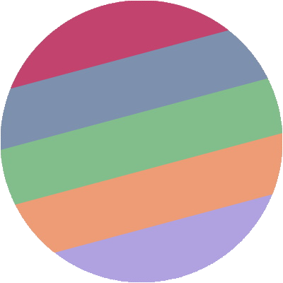
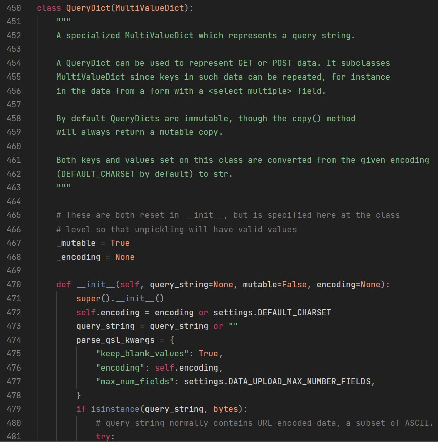
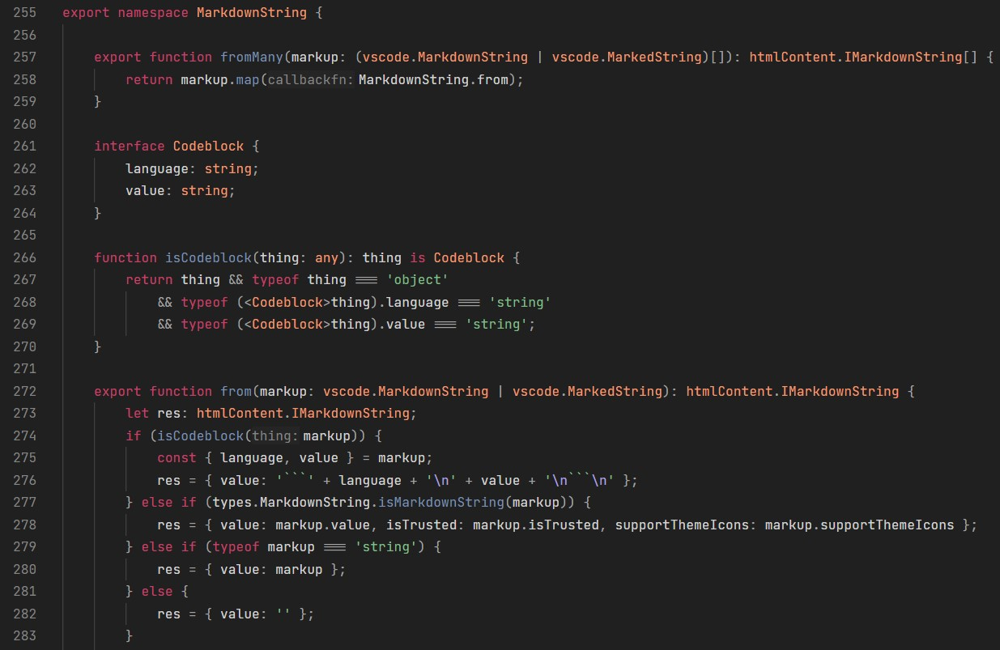

#  Dark Rose Theme

    

## Supported Languages
This theme has been tested with the following programming languages:

* C
* C++
* C#
* CMake
* CSS
* HTML
* Java
* JavaScript
* Json
* Markdown
* PHP
* Python
* Rust
* SCSS
* TypeScript

The theme *may* work with other programming languages, but they have not been tested.

## Screenshots
### Python

<small>Source code: https://github.com/django/django/blob/main/django/http/request.py#L448</small>
 
<small>Font: JetBrains Mono</small>

### C++

<small>Source code: https://github.com/yuzu-emu/yuzu/blob/master/src/yuzu/game_list.cpp#L34</small>
 
<small>Font: JetBrains Mono</small>

### TypeScript

<small>Source code: https://github.com/microsoft/vscode/blob/main/src/vs/workbench/api/common/extHostTypeConverters.ts#L307</small>
 
<small>Font: JetBrains Mono</small>

## Contributing
Everyone is free to contribute if they wish to do so.
